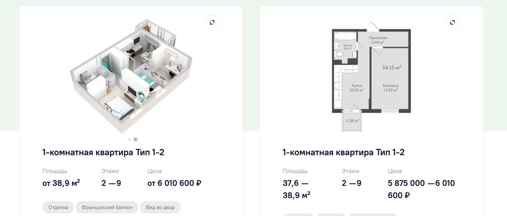

# Picture

## Ленивая загрузка изображений
### Как работает
Скрипт подключён для всех элементов, у которых есть атрибут `loading="lazy"`. Вместо src/source атрибутов в тегах проставляются их data-аналоги(data-src/data-source), если в браузере поддерживается нативная ленивая загрузка изображений или не поддерживается Intersection Observer API, то при загрузке скрипта сразу же data-атрибуты подменяются на необходимые и ленивая загрузка срабатывает либо нативно, либо пассивно (т.к. по сути страница, стили и скрипты уже загрузились). Иначе, для случая, когда в браузере нет нативной ленивой подгрузки, но есть поддержка Intersection Observer API подмена атрибутов срабатывает при доскролле страницы на расстояние в размер экрана.

### Как настроить
#### IMG
**До:**
```html

```

**После:**
```html

```

#### PICTURE
**До:**
```html
<picture class="some-class">
    <source media="(min-width: ...px)"
            srcset="/images/picture/first-screen-bg.jpg"
            type="image/sometype">
    <source media="(min-width: ...px)"
            srcset="/images/picture/first-screen-bg.jpg"
            type="image/sometype">
    <!--...-->
    
</picture>
```

**После:**
```html
<picture style="background-image: url('path/to/placeholder')"
         class="some-class">
    <source media="(min-width: ...px)"
            loading="lazy"
            data-srcset="/images/picture/first-screen-bg.jpg"
            type="image/sometype">
    <source media="(min-width: ...px)" 
            loading="lazy"
            data-srcset="/images/picture/first-screen-bg.jpg"
            type="image/sometype">
    <!--...-->
    
</picture>
```

#### IFRAME
**До:**
```html
<iframe src="some/path"
        class="some-class"></iframe>
```

**После:**
```html
<iframe loading="lazy"
        data-src="some/path"
        class="some-class"></iframe>
```

## Размеры изображений

### Первый экран
#### Версия 1, 3 = на всю ширину экрана


| Брейк (min-width) | Размер, px | Размер 2x, px |
|:-----------------:|:----------:|:-------------:|
|        320        |    669     |     1338      |
|        670        |    959     |     1918      |
|        960        |    1279    |     2558      |
|       1280        |    1439    |     2878      |
|       1440        |    1599    |     3198      |
|       1600        |    1919    |     3838      |
|       1920        |    2560    |     5120      |

#### Версия 2


| Брейк (min-width) | Размер, px | Размер 2x, px |
|:-----------------:|:----------:|:-------------:|
|        320        |    631     |     1262      |
|        670        |    906     |     1812      |
|        960        |    1208    |     2816      |
|       1280        |    1360    |     2720      |
|       1440        |    1511    |     3022      |


| Брейк (min-width) | Размер, px | Размер 2x, px |
|:-----------------:|:----------:|:-------------:|
|        320        |    631     |     1262      |
|        670        |    906     |     1812      |
|        960        |    1208    |     2816      |
|       1280        |    1360    |     2720      |
|       1440        |    1511    |     3022      |
|       1600        |    1813    |     3626      |
|       1920        |    2417    |     4834      |

### Слайдер на ширину контента


| Брейк (min-width) | Размер, px | Размер 2x, px |
|:-----------------:|:----------:|:-------------:|
|        320        |    632     |     1264      |
|        670        |    906     |     1812      |
|        960        |    1208    |     2416      |
|       1280        |    1280    |     2560      |
|       1440        |    1422    |     2844      |

### Слайдер с фактоидом


| Брейк (min-width) | Размер, px | Размер 2x, px |
|:-----------------:|:----------:|:-------------:|
|        320        |    632     |     1264      |
|        670        |    800     |     1600      |
|        960        |    1066    |     2132      |
|       1280        |    720     |     1440      |
|       1440        |    800     |     1600      |

### Слайдер УТП


Картинки должны вписываться по высоте, поэтому, легче высчитать ширину по формуле: `w*ch/h`, где:

`w` - исходная ширина изображения;

`h` - исходная высота изображения;

`ch` - максимальная высота блока на данном брейке

| Брейк (min-width) | ch, px | Ширина, из исходного изображения<br/>1440 на 800, px | Ширина 2x, px |
|:-----------------:|:------:|:----------------------------------------------------:|:-------------:|
|        320        |  370   |                  1440*370/800 = 666                  |     1332      |
|        670        |  370   |                  1440*370/800 = 666                  |     1332      |
|        960        |  480   |                  1440*480/800 = 864                  |     1728      |
|       1280        |  432   |                  1440*432/800 = 778                  |     1556      |
|       1440        |  480   |                  1440*480/800 = 864                  |     1728      |

### Слайдер Новости
### Блок Акции


| Брейк (min-width) | Размер, px | Размер 2x, px |
|:-----------------:|:----------:|:-------------:|
|        320        |    558     |     1116      |
|        670        |    387     |      774      |
|        960        |    516     |     1032      |
|       1280        |    360     |      720      |
|       1440        |    400     |      800      |

### Блок Типовые квартиры

1) Превью


| Брейк (min-width) | Размер, px | Размер 2x, px |
|:-----------------:|:----------:|:-------------:|
|        320        |    252     |      504      |
|        670        |    360     |      720      |
|        960        |    480     |      960      |
|       1280        |    520     |     1040      |
|       1440        |    578     |     1156      |


2) Карточка помещения



| Брейк (min-width) | Размер, px | Размер 2x, px |
|:-----------------:|:----------:|:-------------:|
| Блок в 2 карточки |            |               |
|        320        |    440     |      880      |
|        670        |    304     |      608      |
|        960        |    406     |      812      |
|       1280        |    428     |      856      |
|       1440        |    475     |      950      |
| Блок в 3 карточки |            |               |
|        320        |    440     |      880      |
|        670        |    304     |      608      |
|        960        |    406     |      812      |
|       1280        |    285     |      570      |
|       1440        |    316     |      632      |

### Карточка квартиры

#### Планировки/планы


| Брейк (min-width) | Размер, px | Размер 2x, px |
|:-----------------:|:----------:|:-------------:|
|        320        |    540     |     1080      |
|        670        |    773     |     1546      |
|        960        |    640     |     1280      |
|       1280        |    720     |     1440      |
|       1440        |    800     |     1600      |

#### Похожие квартиры


| Брейк (min-width) | ВЫСОТА, px | ВЫСОТА 2x, px |
|:-----------------:|:----------:|:-------------:|
|        320        |    196     |      392      |
|        670        |    240     |      480      |

### Страница ошибок
### Заглушка


| Брейк (min-width) | Размер, px | Размер 2x, px |
|:-----------------:|:----------:|:-------------:|
|        320        |    669     |     1338      |
|        670        |    959     |     1918      |
|        960        |    1279    |     2558      |
|       1280        |    1439    |     2878      |
|       1440        |    1599    |     3198      |
|       1600        |    1919    |     3838      |
|       1920        |    2560    |     5120      |
